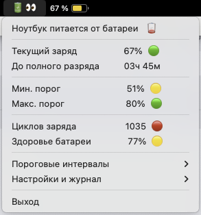

# Macbat 🔋

**Macbat** — это бесплатная утилита для macOS, которая помогает продлить срок службы аккумулятора вашего MacBook. Она отслеживает уровень заряда и отправляет системные уведомления, когда необходимо подключить или отключить зарядное устройство, чтобы поддерживать заряд в оптимальном диапазоне (например, от 20% до 80%).




Утилита работает в фоновом режиме и предоставляет удобный доступ к основным функциям через иконку в системном трее.

## Особенности

- **Мониторинг в реальном времени**: Отслеживает уровень заряда и состояние подключения к сети.
- **Настраиваемые пороги**: Позволяет установить минимальный и максимальный уровни заряда для получения уведомлений.
- **Системные уведомления**: Информирует о необходимости подключить или отключить зарядку.
- **Интерфейс в системном трее**: Удобное меню для быстрого доступа к информации о батарее, логам и настройкам.
- **Фоновый режим**: Работает как фоновый агент `launchd`, не требуя постоянного внимания.
- **Простота установки**: Легко устанавливается и удаляется.

## Установка через Homebrew

Вы можете установить Macbat с помощью [Homebrew](https://brew.sh/):

```bash
# Сначала подключите наш репозиторий (tap)
brew tap qzeleza/macbat

# Затем установите приложение
brew install macbat
```

После установки приложение необходимо запустить вручную:

```bash
# Запустить приложение без аргументов - автоматически установит необходимые компоненты и запустит фоновые службы
macbat
```

После запуска приложение будет работать в фоновом режиме и автоматически запускаться при загрузке системы.

Результат Вы можете увидеть в системном трее.

## Обновление

Для обновления приложения используйте команду:

```bash
brew update && brew upgrade macbat
```

## Использование

### Командная строка

Утилита поддерживает следующие флаги командной строки:

| Флаг                  | Описание                                                                  |
| --------------------- | ------------------------------------------------------------------------- |
| `--uninstall`         | Полностью удалить приложение и все его компоненты из системы.             |
| `--background`        | (Внутренний) Запускает приложение в режиме фонового мониторинга.          |
| `--gui-agent`         | (Внутренний) Запускает агент системного трея.                             |
| `--config`            | Открыть файл конфигурации `config.json` в текстовом редакторе `nano`.     |
| `--log`               | Показать содержимое файла логов `macbat.log`.                             |
| `--version`           | Показать текущую версию приложения.                                       |
| `--help`              | Показать справку по командам.                                             |

### Системный трей

После запуска в системном трее появится иконка приложения, по нажатию на которую открывается меню:

- **Состояние**: Отображает текущий уровень заряда и статус (Заряжается / Разряжается).
- **Пороги (мин/макс)**: Показывает установленные в конфигурации минимальный и максимальный пороги заряда.
- **Циклы зарядки**: Отображает количество циклов перезарядки аккумулятора.
- **Здоровье батареи**: Показывает максимальную емкость и общее состояние аккумулятора.
- **Перезапустить фон**: Перезапускает фоновый процесс мониторинга.
- **Открыть конфиг**: Открывает файл `config.json` для редактирования.
- **Открыть логи**: Открывает директорию с логами приложения.
- **Выход**: Завершает работу приложения.

## Конфигурация

Файл конфигурации `config.json` находится в `~/Library/Application Support/macbat/`. Вы можете изменить его вручную или с помощью команды `macbat --config`.

Пример конфигурации:

```json
{
  "min_threshold": 20,
  "max_threshold": 80,
  "check_interval_charging": 60,
  "check_interval_discharging": 180,
  "notification_interval": 300,
  "max_notifications": 3,
  "debug_enabled": true,
  "log_path": "",
  "error_log_path": ""
}
```

- `min_threshold`: Нижний порог заряда (в %), при котором придет уведомление о необходимости подключить зарядку.
- `max_threshold`: Верхний порог заряда (в %), при котором придет уведомление о необходимости отключить зарядку.
- `check_interval_charging`: Интервал проверки состояния батареи (в секундах) во время зарядки.
- `check_interval_discharging`: Интервал проверки состояния батареи (в секундах) во время разрядки.
- `notification_interval`: Минимальный интервал между уведомлениями (в секундах).
- `max_notifications`: Максимальное количество уведомлений для каждого порога за один цикл.
- `debug_enabled`: Включает или отключает подробное логирование.

## Сборка из исходников

Для сборки проекта из исходного кода вам понадобится [Go](https://golang.org/).

1. Установите Xcode Command Line Tools:
   ```bash
   xcode-select --install
   ```

2. Клонируйте репозиторий:
   ```bash
   git clone https://github.com/zeleza/macbat.git
   cd macbat
   ```

3. Соберите приложение:
   ```bash
   go build -o macbat ./cmd/macbat
   ```

4. Установите приложение:
   ```bash
   ./macbat
   ```

## Вклад в проект

Мы приветствуем любой вклад в развитие проекта! Если у вас есть идеи, предложения или вы нашли ошибку, пожалуйста, создайте [issue](https://github.com/zeleza/macbat/issues) или отправьте [pull request](https://github.com/zeleza/macbat/pulls).

## Лицензия

Этот проект распространяется под лицензией MIT. Подробности смотрите в файле `LICENSE`.
